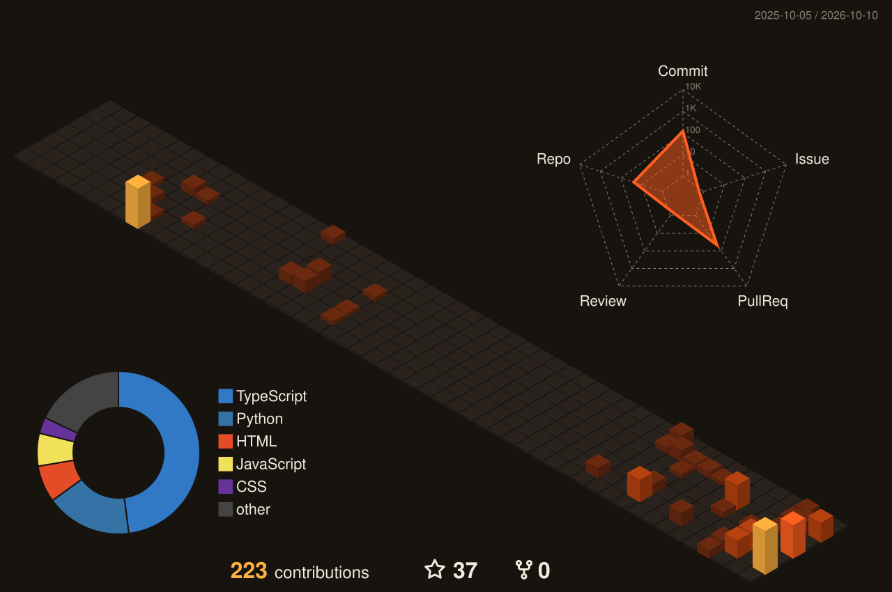

  

  
  
  
  
  

 

<picture>
  <source media="(prefers-color-scheme: light)" srcset="assets/h-about-light.svg" />
  
</picture>

  

 

<picture>
  <source media="(prefers-color-scheme: light)" srcset="assets/h-projects-light.svg" />
  
</picture>

  
  

  
  

  

 

<picture>
  <source media="(prefers-color-scheme: light)" srcset="assets/h-toolbox-light.svg" />
  
</picture>

    
  

  
  
  
  
  
  
  
  

 

<picture>
  <source media="(prefers-color-scheme: light)" srcset="assets/h-activity-light.svg" />
  
</picture>

  

  
  

  

  <picture>
    <source media="(prefers-color-scheme: light)" srcset="https://raw.githubusercontent.com/Rakshithraj14/Rakshithraj14/output/snake-forge-light.svg" />
    
  </picture>

  
  
  
  
  

  
  
  

 

  

<!--  -->